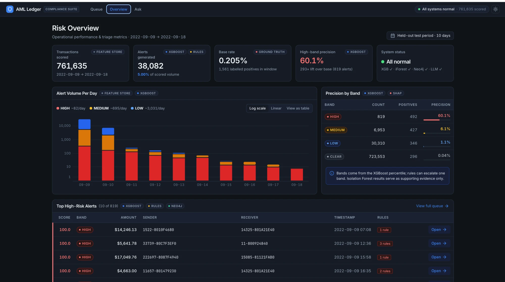
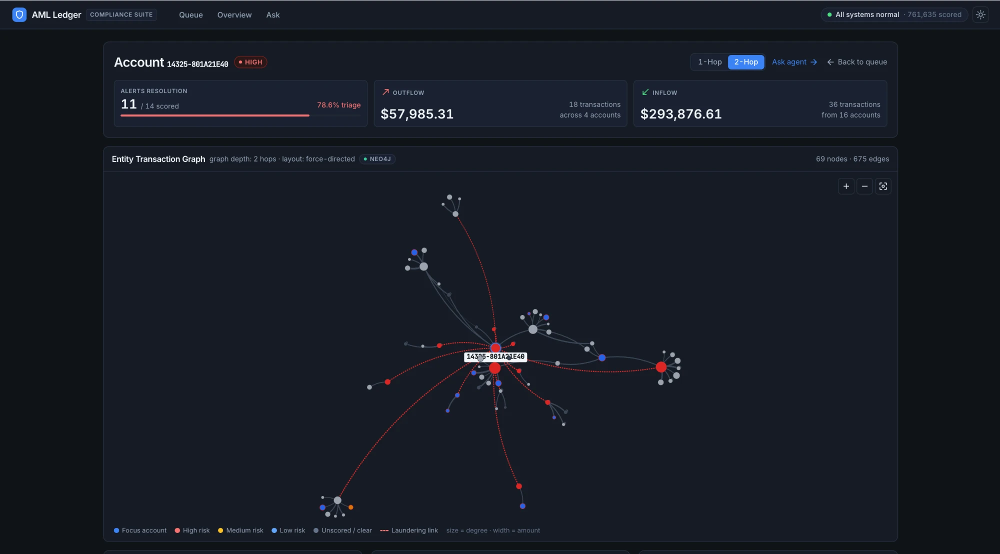
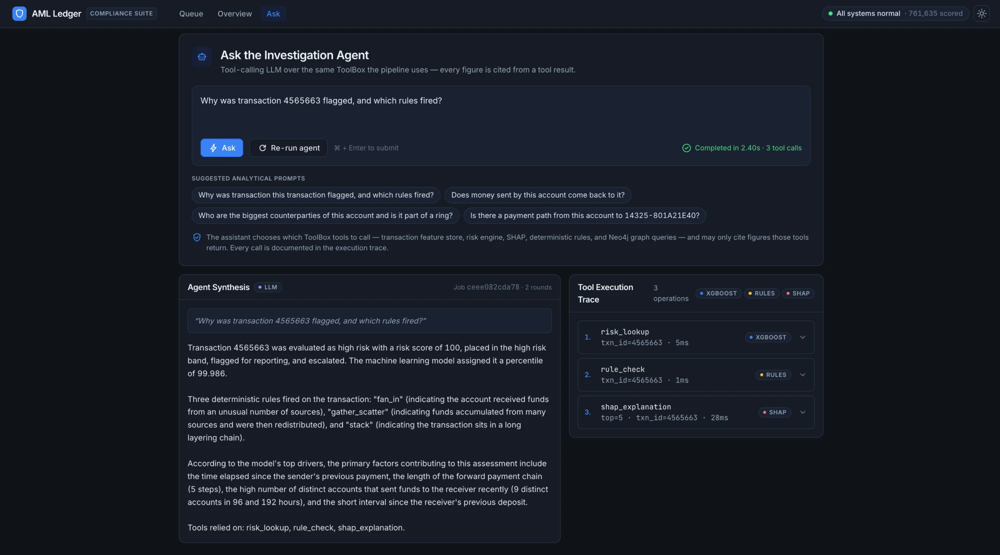

# AML Ledger — transaction-monitoring & alert triage

End-to-end anti-money-laundering pipeline on the IBM AML synthetic dataset: feature engineering → XGBoost + deterministic rules + Isolation Forest → risk bands → SHAP + Neo4j graph evidence → LLM-narrated investigation reports, served by FastAPI to a React triage console.

**Held-out test period (761,635 txns, 0.205 % positives):** XGBoost PR-AUC 0.374 · HIGH band 819 alerts at **60 % precision** (293× base rate) · MEDIUM 6 % · LOW 1 %.

---

## Screenshots

**Risk overview** — headline metrics, alert volume per day (log scale), precision by band, top HIGH alerts. Every panel is tagged with the engine that produced it.



**Account network** — 2-hop Neo4j neighbourhood of `14325-801A21E40`; node colour = worst band, size = degree, dashed red = labelled laundering edge.



**Investigation agent** — the LLM chose `risk_lookup` → `rule_check` → `shap_explanation`, answered in 2.4 s, and every call is in the execution trace.



---

## Architecture

```
HI-Small_Trans.csv ─► ml/data.py ─► ml/features/ (transaction · behavioural · graph)
                                          │  features.parquet  (5.08 M × 78)
              ┌───────────────────────────┼───────────────────────────┐
        XGBoost (ml/models/xgb)   Rules (ml/models/rules)   Isolation Forest (ml/models/iforest)
        supervised, ranks queue   9 AML typologies, can     unsupervised anomaly pct,
                                  escalate one band         evidence only
              └───────────────────────────┼───────────────────────────┘
                                 ml/models/fusion.py
                       percentile → band HIGH / MEDIUM / LOW / CLEAR
                       action     → REPORT / REVIEW / MONITOR / NONE
                                          │
              SHAP (ml/explain)    Neo4j graph (ml/graph)    Agent tools (ml/agent/tools)
                                          │
                     ml/agent: gather → narrate (Gemini)  ·  report.build → markdown
                     ml/agent/ask: tool-calling Q&A over the same ToolBox
                                          │
                              backend/  FastAPI  ──►  frontend/  React
```

Design decisions worth knowing:

- **Bands come from the model percentile, not the probability** — `scale_pos_weight≈1000` makes probabilities uncalibrated.
- **Rules never reorder the queue.** Rules-only PR-AUC is 0.004; they escalate a band when ≥ 2 precise rules co-fire and supply readable evidence.
- **Isolation Forest is evidence only** (PR-AUC 0.002 alone). It is shown as an anomaly percentile, never fused into the score.
- **The LLM writes prose only.** Every figure in a narrative comes from a tool result; the agent is not allowed to compute.
- **Split is by row quantile** (70 / 85 / 100 %), not calendar date — the file has a thin tail to Sep 18.

---

## Repository

```
ml/            pipeline (importable)
  features/    transaction · behavioural · graph feature builders
  models/      xgb · rules · iforest · fusion
  graph/       Neo4j loader + Cypher queries
  agent/       tools · gather/narrate · ask · report
  scripts/     build_features · train · train_iforest · load_graph · score · evaluate · investigate · run_eda · run_patterns
  scripts/checks/  dev sanity checks (not part of the pipeline)
backend/       FastAPI: main.py · deps.py (one-time startup load) · schemas.py · routers/
frontend/      React 19 + Vite + TypeScript + Tailwind 4 + TanStack Query
configs/       config.yaml · features.yaml · rules.yaml   (thresholds, committed)
data/raw/      HI-Small_Trans.csv · HI-Small_Patterns.txt (not committed)
data/processed features.parquet · transactions_clean.parquet (generated)
models/        xgb.json · xgb_columns.json · iforest.joblib (generated)
outputs/       figures · alerts · reports
```

---

## Setup

Requirements: Python 3.11, Node 20+, Neo4j 5 running on `bolt://localhost:7687`, a Gemini API key (optional — without it narratives fall back to a deterministic template and `/ask` is disabled).

```bash
python3 -m venv .venv && .venv/bin/pip install -r requirements.txt
cp .env.example .env            # fill NEO4J_PASSWORD, GEMINI_API_KEY
cd frontend && npm install
```

Put `HI-Small_Trans.csv` and `HI-Small_Patterns.txt` in `data/raw/`, then build the artefacts once:

```bash
.venv/bin/python -m ml.scripts.build_features   # ~2 GB parquet
.venv/bin/python -m ml.scripts.train            # xgb.json
.venv/bin/python -m ml.scripts.train_iforest    # iforest.joblib
.venv/bin/python -m ml.scripts.load_graph       # alerted neighbourhoods → Neo4j
```

## Run

```bash
.venv/bin/uvicorn backend.main:app --reload --port 8000     # loads pipeline once (~10 s)
cd frontend && npm run dev                                   # http://localhost:5173
```

`GET http://localhost:8000/api/health` tells you what is and isn't loaded. Startup never crashes: a missing model or unreachable Neo4j is reported there and the affected endpoints return 503 while the rest keep working. Stop servers with **Ctrl+C** (Ctrl+Z suspends and keeps the port).

CLI equivalents: `python -m ml.scripts.score --top 5`, `python -m ml.scripts.investigate --txn 4565663`, `python -m ml.scripts.evaluate`.

---

## API (`/api`)

| Method | Path | Returns |
|---|---|---|
| GET | `/health` | model / anomaly model / Neo4j / LLM status, rows scored |
| GET | `/stats` | band counts & precision, alerts per day, base rate |
| GET | `/alerts?band=&min_score=&page=&page_size=&sort=` | paginated queue (default excludes CLEAR; `sort=-risk_score`) |
| GET | `/alerts/{id}` | transaction, risk, rules fired, SHAP drivers, money flow, counterparties |
| GET | `/alerts/{id}/report` | markdown case report (narrative spliced in once investigated) |
| POST | `/alerts/{id}/investigate` | 202 + job; `GET` same path to poll. `?force=true` re-runs |
| POST | `/ask` `{question, txn_id?, account_id?}` | 202 + job; `GET /ask/{job_id}` — answer + tool trace |
| GET | `/accounts/{id}` | activity, worst band, Neo4j counterparties / cycles / ring |
| GET | `/accounts/{id}/graph?hops=1\|2&limit=` | nodes + edges for visualisation |
| GET | `/transactions?account=` · `/transactions/{id}` | raw rows over all 5 M txns |
| POST | `/predict` `{txn_ids:[…]}` or `{features:{…}}` | score, band, rules, anomaly |

Interactive docs at `http://localhost:8000/docs`.

---

## Frontend screens

| Route | Screen |
|---|---|
| `/` | Queue — band cards (click to filter), sortable paginated table, filters in the URL |
| `/alerts/:id` | Case file — score / disposition / pattern tiles, SHAP bars, rules, 96 h money flow, counterparties, 1-hop Neo4j mini-graph, Run investigation, SAR-draft report tab |
| `/accounts/:id` | Account network — force-directed graph (1 / 2 hop), counterparties, cycles, shared-counterparty peers |
| `/overview` | Risk overview — headline metrics, alerts-per-day chart, precision by band, top HIGH alerts |
| `/ask` | Investigation agent — free-text question, LLM picks ToolBox tools (incl. Neo4j), answer + auditable trace |

Light and dark themes (header toggle; follows the OS by default, right-click the toggle to re-follow it). Every panel carries a source tag (`NEO4J`, `XGBOOST`, `SHAP`, `RULES`, `LLM`, `FEATURE STORE`) so the origin of each number is visible. Design tokens (Google Stitch export) live in `frontend/src/index.css`.

---

## Known limits

- `find_cycles` (`SENT*2..6` Cypher) takes ~30 s on hub accounts; results are cached per account after the first call. Reduce `max_hops` in `ml/graph/queries.py` if this matters.
- `/predict` with `features` needs a full feature row; scoring a raw new transaction requires rebuilding behavioural/graph features against history and is not exposed.
- Ground-truth labels are surfaced in the UI for evaluation (`ground_truth_label`, precision figures). Remove before any real deployment.
- This is a prioritisation aid on synthetic data, not a determination of wrongdoing.
